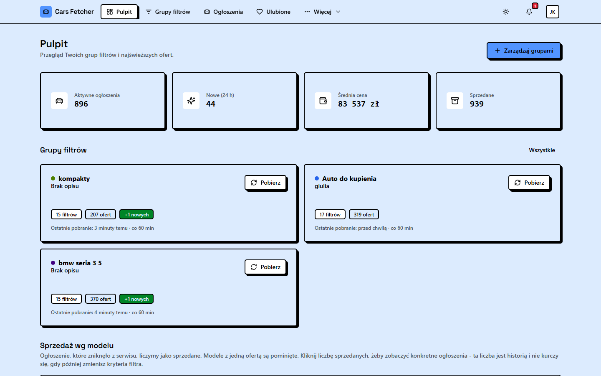
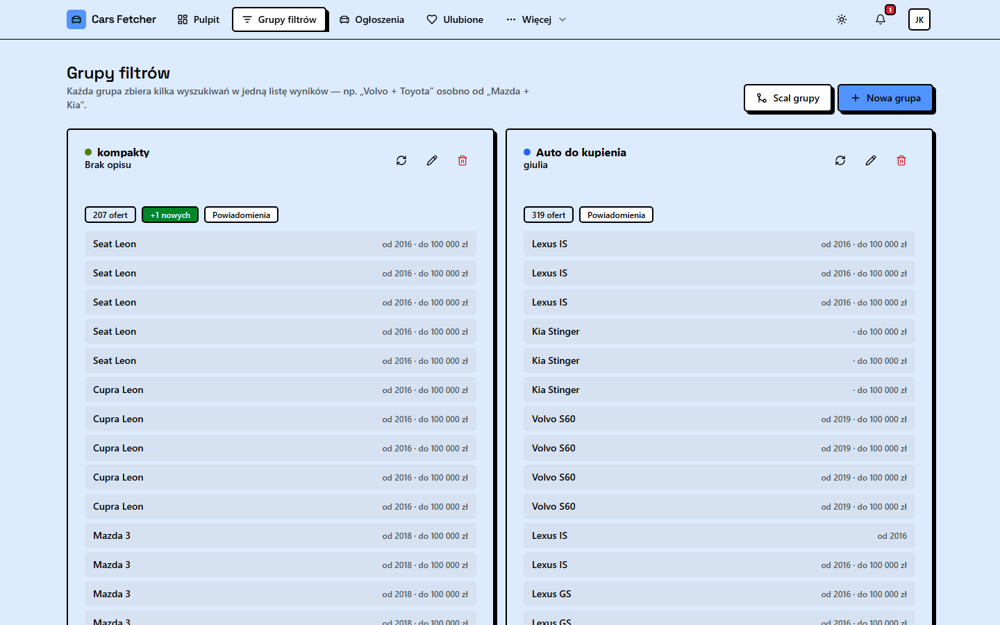
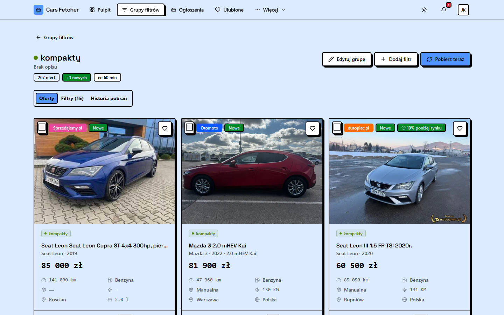
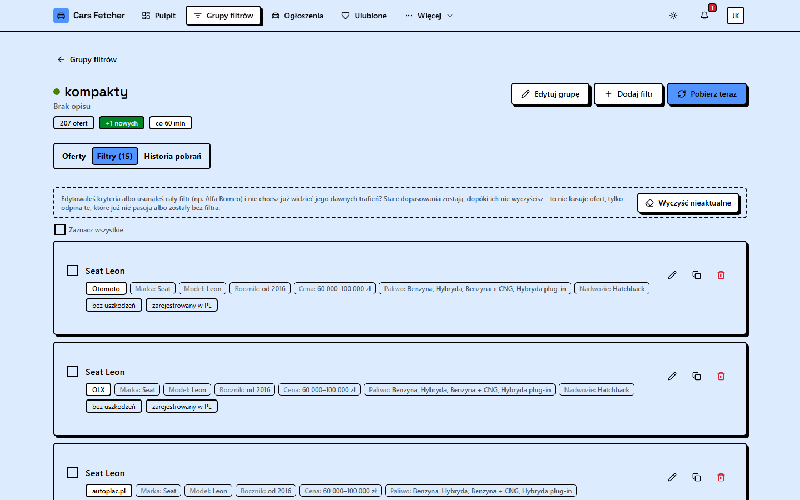
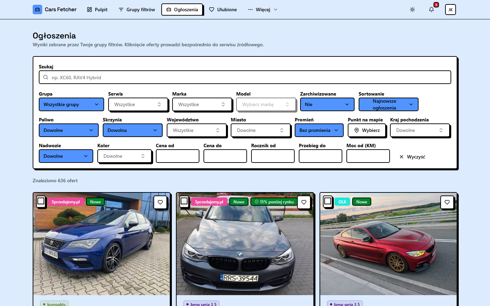
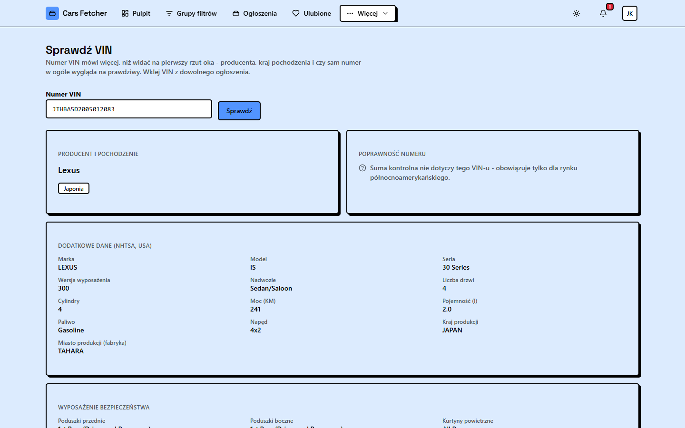
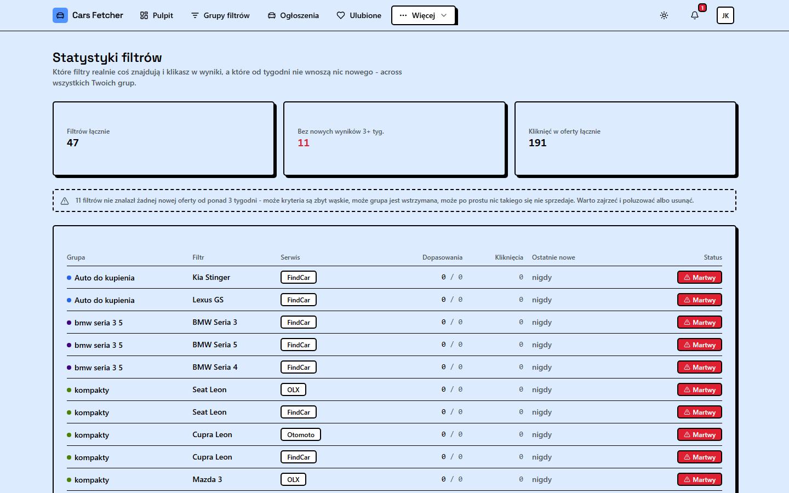
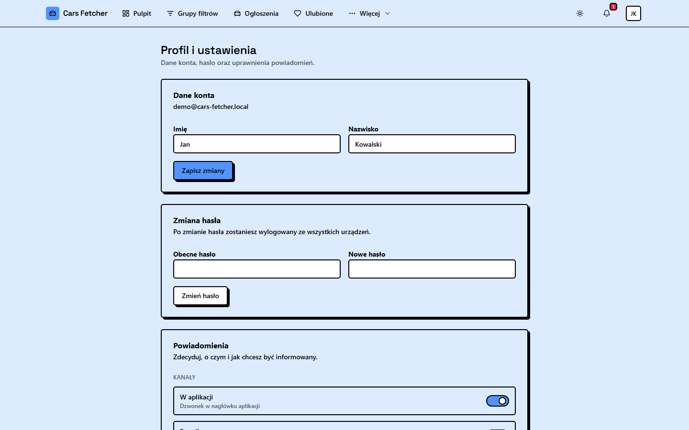
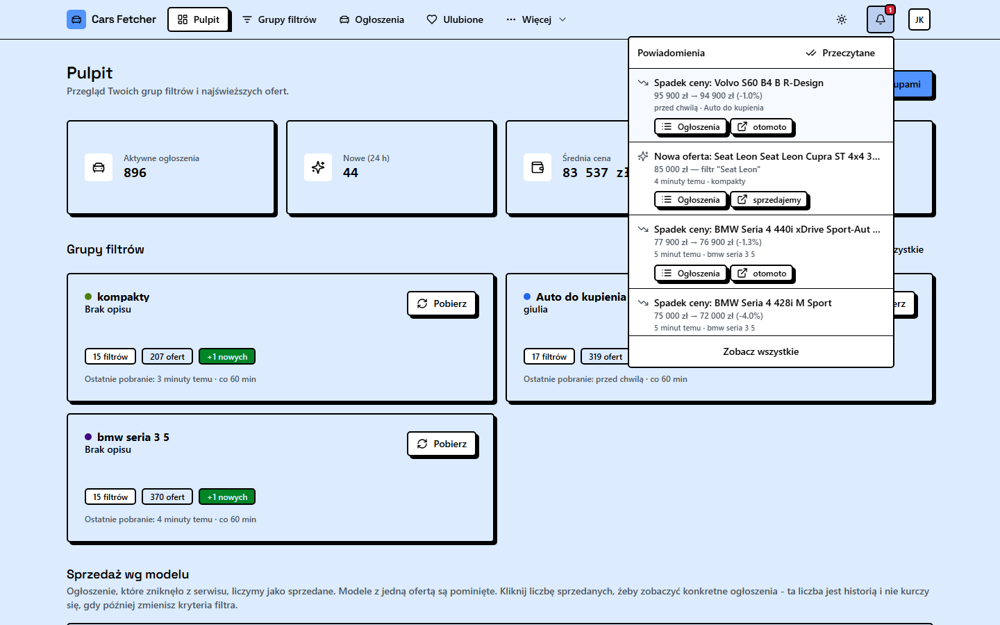

<p align="center"><b>🇵🇱 Polski</b> · <a href="README.en.md">🇬🇧 English</a></p>

<h1 align="center">Cars Fetcher</h1>

<p align="center">
  Agregator ogłoszeń motoryzacyjnych z kilku polskich serwisów w jednym miejscu —
  własne grupy filtrów, powiadomienia o okazjach, wykrywanie duplikatów,
  dekoder VIN i statystyki rynku, zamiast ręcznego odświeżania pięciu zakładek.
</p>

<p align="center">
  
</p>

## Po co to powstało

Szukanie samochodu w Polsce oznacza w praktyce trzymanie otwartych kart z
Otomoto, OLX, autoplac.pl, FindCar i Sprzedajemy.pl naraz, ręczne odświeżanie
i pamiętanie, które ogłoszenie już się widziało. Cars Fetcher robi to za
ciebie: definiujesz kryteria raz (marka, model, cena, przebieg, lokalizacja,
wyposażenie...), aplikacja sama sprawdza wszystkie serwisy w tle na
harmonogramie i powiadamia, gdy pojawi się coś nowego albo wyraźnie tańszego
niż rynek. Projekt prywatny/hobbystyczny, zbudowany pod własne potrzeby przy
szukaniu auta — bez konta w żadnym z tych serwisów, bez publikowania ogłoszeń,
tylko odczyt i agregacja tego, co już jest publicznie dostępne.

## Funkcjonalności

**Zbieranie ofert**
- Pięciu dostawców na żywo: Otomoto (scraper stron publicznych albo oficjalne
  API partnerskie), OLX, autoplac.pl, FindCar, Sprzedajemy.pl.
- Throttling i poszanowanie `robots.txt` wspólne dla wszystkich adapterów
  HTML — nic nie bije w serwery częściej niż raz na ok. 2,5 s na host.
- Harmonogram (cron) odświeżający każdą grupę filtrów wg jej własnego
  interwału, plus ręczny przycisk „Pobierz teraz”.
- Wykrywanie duplikatów: to samo auto wystawione na kilku serwisach naraz
  zlewa się w jedną kartę zamiast zaśmiecać wyniki.

**Grupy filtrów**
- Filtr = jeden zestaw kryteriów na jednym serwisie (marka, model, cena,
  rocznik, przebieg, moc, paliwo, skrzynia, nadwozie, kolor, lokalizacja z
  promieniem na mapie, kraj pochodzenia, historia/stan, wyposażenie...).
  Grupa = kilka filtrów zebranych pod jedną nazwą i jedną listą wyników.
- Tworzenie filtra na kilku serwisach naraz jednym kliknięciem.
- Zbiorcza edycja jednego pola w wielu filtrach naraz.
- Scalanie grup, kopiowanie filtrów, ostrzeżenie przed usunięciem.
- „Wyczyść nieaktualne” — usuwa z wyników oferty, które przestały pasować do
  zmienionych kryteriów, bez utraty historii sprzedaży (patrz niżej).

**Powiadomienia**
- Cztery kanały: w aplikacji (dzwonek), e-mail, push w przeglądarce,
  Telegram (bot na własnym pollingu — działa też bez publicznego adresu).
- Pięć typów zdarzeń: nowe ogłoszenia, **okazje** (nowa oferta od razu X%
  poniżej mediany rynkowej dla podobnych aut — nie trzeba czekać na spadek
  ceny), spadki/wzrosty cen, usunięte oferty, błędy pobierania.
- Progi i cisza nocna konfigurowalne per użytkownik.

**Rynek i statystyki**
- Pulpit: aktywne ogłoszenia, nowe w 24h, średnia cena, sprzedane, sprzedaż
  wg modelu z proporcją i medianą dni do sprzedaży — z linkami do
  konkretnych ofert, licznik historyczny nie kurczy się przy zmianie
  filtrów.
- Statystyki filtrów: które faktycznie coś znajdują, które nie znalazły
  nic nowego od tygodni („martwe” filtry).
- Śledzenie sprzedawców/komisów: ile aut ma dany sprzedawca, ostrzeżenie
  przy podejrzanie długo wiszącej ofercie.
- Sugerowana oferta — cena vs mediana rynkowa i mediana dni do sprzedaży dla
  podobnych aut.
- Porównywarka (do 4 ofert obok siebie), ulubione, ostatnio oglądane.

**VIN i wiedza**
- Dekoder VIN offline: WMI (producent/kraj), suma kontrolna, rocznik —
  działa bez sieci.
- Wzbogacenie danymi NHTSA vPIC (USA): silnik, poduszki, pasy, nadwozie.
- Link wprost do CEPiK (oficjalne, darmowe źródło historii pojazdu w
  Polsce) z VIN-em skopiowanym do schowka.
- Szkielet integracji z płatnymi raportami AutoDNA/carVertical (wyłączony
  domyślnie, wymaga klucza API).
- Baza wiedzy o modelach: silniki, znane usterki, na co zwrócić uwagę —
  z opcjonalnym generowaniem treści przez Claude (Anthropic API).

**Konto i dostęp**
- Logowanie e-mail+hasło albo Google OAuth, weryfikacja adresu e-mail.
- Panel admina (statystyki użycia, stan scraperów, użytkownicy).
- Tryb jasny/ciemny, pełna responsywność (filtry, tabele, przyciski na
  telefonie).

## Zrzuty ekranu

| | |
|---|---|
|  Grupy filtrów |  Szczegóły grupy |
|  Filtry w grupie |  Ogłoszenia i filtry |
|  Dekoder VIN |  Statystyki filtrów |
|  Profil i powiadomienia |  Dzwonek powiadomień |

## Stack technologiczny

**Frontend** — `apps/web`
- React 19 + TypeScript, Vite 7
- TanStack Router (routing typowany) + TanStack Query (cache/synchronizacja z API)
- Tailwind CSS v4 (bez pliku konfiguracyjnego, tokeny w `styles.css`)
- Komponenty UI: [neobrutalism.dev](https://www.neobrutalism.dev) (na bazie
  shadcn/ui) — grube czarne obwódki, twarde cienie z przesunięciem
- Leaflet / react-leaflet (wybór lokalizacji na mapie)
- Sonner (toasty), lucide-react (ikony)

**Backend** — `apps/api`
- Express 5 + TypeScript
- Drizzle ORM + PostgreSQL 17
- Zod (walidacja wejścia na każdym endpoincie)
- Playwright + Cheerio (scraping, gdy serwis nie ma publicznego API)
- node-cron (harmonogram odświeżania), Pino (logi strukturalne)
- JWT (access + refresh), bcrypt, Google OAuth2
- web-push (VAPID), Nodemailer (SMTP), własny klient Telegram Bot API (long
  polling, bez webhooka)

**Infrastruktura**
- Docker Compose: `postgres`, `api`, `web` (nginx, serwuje zbudowany
  frontend i proxy'uje `/api`), `adminer` (podgląd bazy)
- Monorepo: npm workspaces (`apps/api`, `apps/web`)

## Struktura repo

```
apps/
  api/
    src/
      modules/       # domeny: auth, filters, fetching, listings, notifications,
                      # telegram, sellers, stats, vin, knowledge, admin, taxonomy, geo
      providers/      # adaptery serwisów (otomoto, olx, autoplac, findcar, sprzedajemy)
      db/             # schema Drizzle + migracje
      jobs/            # harmonogram (node-cron)
    drizzle/          # wygenerowane migracje SQL
  web/
    src/
      pages/           # jedna strona = jeden route
      components/
        ui/            # prymitywy neobrutalism.dev/shadcn
      lib/             # klient API, hooki TanStack Query, formatowanie
docker-compose.yml
```

## Uruchomienie

### Docker (najprostsze)

```bash
cp .env.example .env
# uzupełnij JWT_ACCESS_SECRET / JWT_REFRESH_SECRET (patrz komentarz w .env.example)
docker compose up -d --build
```

Aplikacja wystartuje na `http://localhost:8090` (frontend), API na
`http://localhost:4000`, Adminer (podgląd bazy) na `http://localhost:8080`.
Migracje bazy uruchamiają się automatycznie przy starcie kontenera `api`.

**Własna domena w sieci lokalnej** zamiast `localhost:8090` — kontener `web`
nasłuchuje też na porcie 80, więc wystarczy w pliku hosts (`/etc/hosts` albo
`C:\Windows\System32\drivers\etc\hosts`) dopisać `127.0.0.1 cars-fetcher.pl`
(lub inną własną nazwę) i wejść bez numeru portu.

### Tryb deweloperski (bez Dockera dla API/frontendu)

```bash
npm install
npm run db:up          # tylko Postgres w Dockerze
npm run db:migrate
npm run db:seed         # opcjonalnie: konto demo + przykładowe dane
npm run dev             # api na :4000, web na :5173 (hot reload)
```

## Zmienne środowiskowe

Pełna lista z komentarzami w [`.env.example`](.env.example). Wymagane do
startu: `JWT_ACCESS_SECRET`, `JWT_REFRESH_SECRET`. Wszystko poniżej jest
opcjonalne — brakująca integracja po prostu się wyłącza, aplikacja działa
dalej bez niej:

| Integracja | Zmienne | Efekt gdy brak |
|---|---|---|
| Otomoto (oficjalne API) | `OTOMOTO_SOURCE=api`, `OTOMOTO_CLIENT_ID`, `OTOMOTO_CLIENT_SECRET`, `OTOMOTO_USERNAME`, `OTOMOTO_PASSWORD` | Scraper stron publicznych zamiast API |
| E-mail (SMTP) | `SMTP_HOST`, `SMTP_USER`, `SMTP_PASS`, ... | Powiadomienia e-mail pomijane, log ostrzeżenia |
| Push w przeglądarce | `VAPID_PUBLIC_KEY`, `VAPID_PRIVATE_KEY` (`npm run push:generate-keys`) | Kanał push ukryty w ustawieniach |
| Logowanie Google | `GOOGLE_CLIENT_ID`, `GOOGLE_CLIENT_SECRET` | Przycisk Google ukryty |
| Telegram | `TELEGRAM_BOT_TOKEN` (z @BotFather) | Kanał Telegram pokazuje „nieskonfigurowany” |
| Baza wiedzy (LLM) | `ANTHROPIC_API_KEY` | Baza wiedzy serwuje tylko ręcznie wprowadzone treści |
| Raport historii pojazdu | `VEHICLE_HISTORY_PROVIDER`, `AUTODNA_API_KEY` lub `CARVERTICAL_API_KEY` | Sekcja płatnego raportu ukryta (VIN nadal działa offline + NHTSA + link do CEPiK) |

## Uwagi / ograniczenia

- **Scraping etycznie skonfigurowany**: throttling, `robots.txt`, brak
  logowania się na konta serwisów. Adapter Otomoto woli oficjalne API, gdy
  jest skonfigurowane.
- **Integracje AutoDNA/carVertical** to szkielet architektury (typy,
  routing, UI, admin-gating) zbudowany bez potwierdzonej, aktualnej
  dokumentacji tych płatnych API — wymaga weryfikacji przed pierwszym realnym
  użyciem, oznaczone w kodzie.
- **Suma kontrolna VIN** obowiązuje tylko dla rynku północnoamerykańskiego —
  aplikacja to jawnie zaznacza zamiast fałszywie walidować europejskie VIN-y.
- Wdrożenie domyślnie zakłada sieć lokalną (LAN) — stąd Telegram na pollingu
  zamiast webhooka, który wymagałby publicznego adresu HTTPS.

## Konto demo

Po `npm run db:seed`: `demo@cars-fetcher.local` / `Demo1234` — konto z
przykładowymi grupami filtrów i ogłoszeniami do rozejrzenia się bez
podpinania prawdziwych źródeł.
